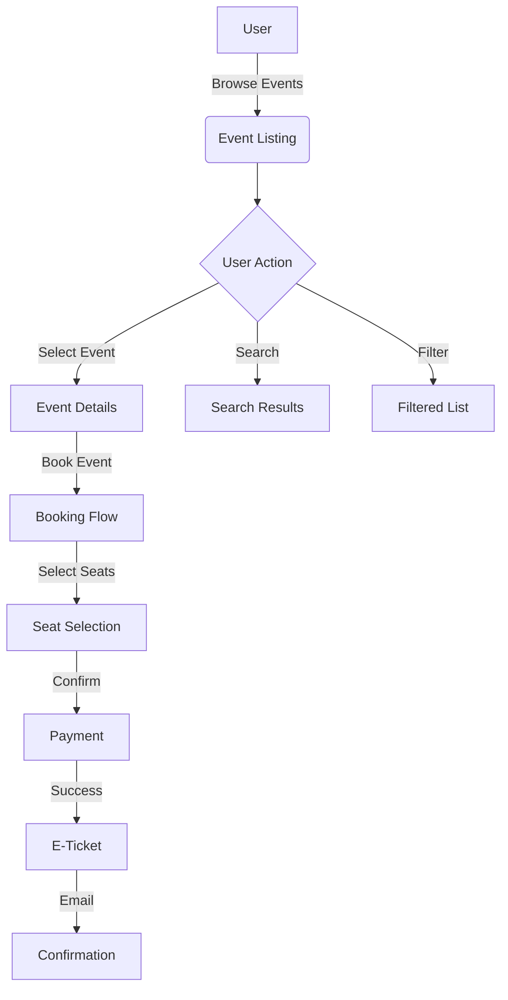

# 🎫 Booking Platform Documentation

Welcome to the Booking Platform documentation! This wiki provides comprehensive information about the platform's architecture, features, and implementation details.

## 📚 Table of Contents

1. [System Architecture](./architecture.md)
2. [Authentication Flow](./auth-flow.md)
3. [Database Schema](./database-schema.md)
4. [API Documentation](./api-docs.md)
5. [Frontend Components](./frontend-components.md)
6. [State Management](./state-management.md)
7. [Testing Strategy](./testing.md)
8. [Deployment Guide](./deployment.md)

## 🎯 Core Features

### Event Management
- Event creation and modification
- Category management
- Pricing and inventory control
- Media management
- Location and venue integration

### User Management
- Role-based access control
- Profile management
- Booking history
- Preferences and settings
- Notification preferences

### Booking System
- Real-time availability checking
- Seat selection interface
- Payment processing
- E-ticket generation
- Cancellation handling

### Administrative Tools
- Dashboard analytics
- User management
- Event management
- Support ticket system
- Report generation

## 🔄 Application Flow

## 🏗️ System Components

### Frontend Architecture
- Component hierarchy
- Routing structure
- State management
- UI/UX design system
- Responsive layouts

### Backend Services
- Authentication service
- Event management service
- Booking service
- Payment service
- Notification service

### Database Design
- Entity relationships
- Data normalization
- Indexing strategy
- Backup procedures
- Data migration
