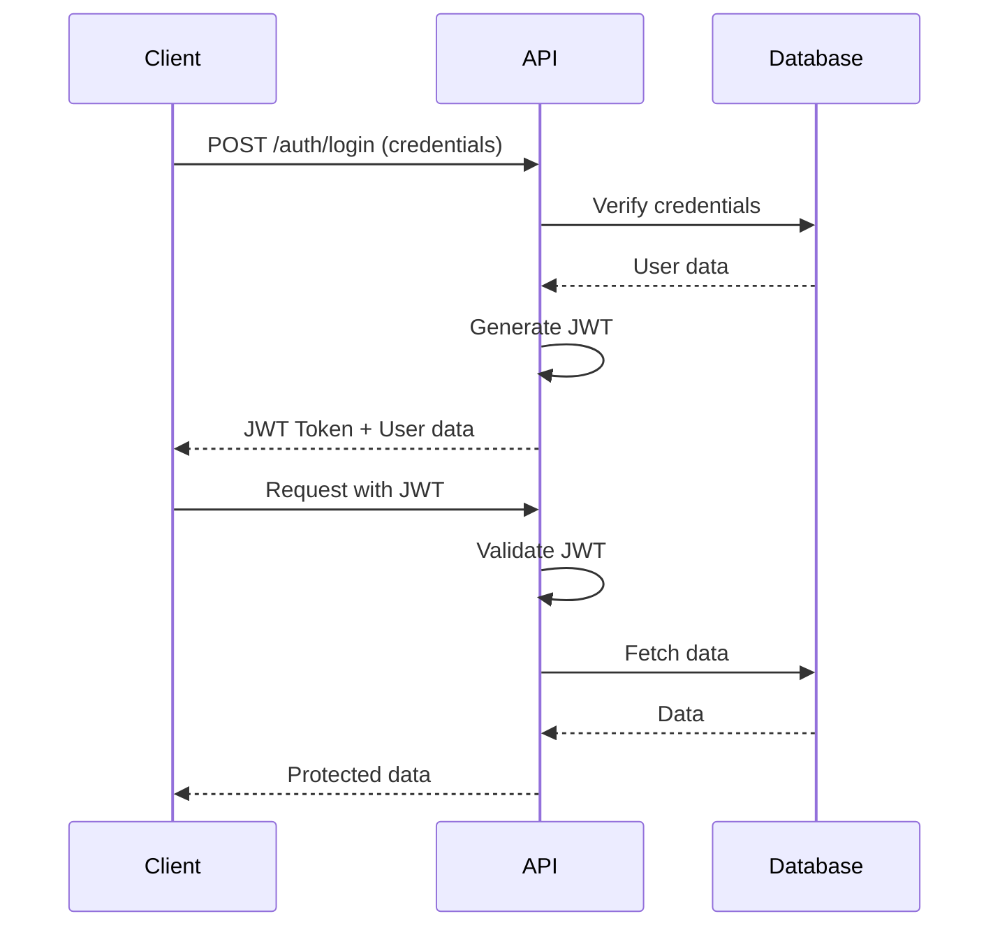

# Authentication Flow

## Overview

The Booking Platform uses JWT (JSON Web Token) based authentication to secure API endpoints and manage user sessions. This document details the authentication flow and implementation.

## Authentication Flow Diagram



## Implementation Details

### 1. User Authentication

#### Login Process
1. User submits credentials (email/password)
2. Server validates credentials
3. If valid, generates JWT token
4. Returns token and user data
5. Client stores token in localStorage

#### JWT Token Structure
```javascript
{
  "header": {
    "alg": "HS256",
    "typ": "JWT"
  },
  "payload": {
    "userId": "123",
    "email": "user@example.com",
    "isAdmin": false,
    "iat": 1622505600,
    "exp": 1622592000
  },
  "signature": "..."
}
```

### 2. Protected Routes

#### Frontend Protection
```javascript
// ProtectedRoute component
const ProtectedRoute = ({ children }) => {
  const { isAuthenticated, loading } = useAuth();
  
  if (loading) {
    return <Loader />;
  }
  
  return isAuthenticated ? children : <Navigate to="/login" />;
};
```

#### Backend Protection
```javascript
// Auth middleware
const authMiddleware = async (req, res, next) => {
  try {
    const token = req.headers.authorization?.split(' ')[1];
    if (!token) {
      throw new Error('No token provided');
    }
    
    const decoded = jwt.verify(token, process.env.JWT_SECRET);
    req.user = decoded;
    next();
  } catch (error) {
    res.status(401).json({ error: 'Unauthorized' });
  }
};
```

### 3. Token Management

#### Token Storage
- Frontend: localStorage
- Token format: Bearer token
- Refresh token: Not implemented (future enhancement)

#### Token Expiration
- Default expiration: 24 hours
- Auto logout on expiration
- Configurable via environment variable

### 4. Security Measures

#### Password Security
- Hashing: bcrypt
- Salt rounds: 12
- Min password length: 8 characters

#### API Security
- Rate limiting
- CORS protection
- HTTPS enforcement
- XSS prevention
- CSRF protection

### 5. Error Handling

#### Authentication Errors
```javascript
{
  "error": "Authentication Error",
  "message": "Invalid credentials",
  "code": "AUTH_001"
}
```

#### Token Errors
```javascript
{
  "error": "Token Error",
  "message": "Token expired",
  "code": "TOKEN_001"
}
```

### 6. Session Management

#### Login Session
```javascript
const login = async (email, password) => {
  const response = await api.post('/auth/login', {
    email,
    password
  });
  
  if (response.token) {
    localStorage.setItem('token', response.token);
    setAuthState({
      isAuthenticated: true,
      user: response.user
    });
  }
};
```

#### Logout Session
```javascript
const logout = () => {
  localStorage.removeItem('token');
  setAuthState({
    isAuthenticated: false,
    user: null
  });
};
```

### 7. Context Provider

```javascript
// AuthContext configuration
const AuthProvider = ({ children }) => {
  const [state, setState] = useState({
    isAuthenticated: false,
    user: null,
    loading: true
  });

  useEffect(() => {
    // Check token and validate on mount
    const validateAuth = async () => {
      const token = localStorage.getItem('token');
      if (token) {
        try {
          const user = await api.get('/auth/validate');
          setState({
            isAuthenticated: true,
            user,
            loading: false
          });
        } catch {
          setState({
            isAuthenticated: false,
            user: null,
            loading: false
          });
        }
      } else {
        setState({
          isAuthenticated: false,
          user: null,
          loading: false
        });
      }
    };
    
    validateAuth();
  }, []);

  return (
    <AuthContext.Provider value={{ ...state, login, logout }}>
      {children}
    </AuthContext.Provider>
  );
};
```

## Best Practices

1. **Token Security**
   - Never store sensitive data in JWT payload
   - Use short expiration times
   - Implement token refresh mechanism
   - Use secure storage methods

2. **Password Security**
   - Enforce strong password policies
   - Implement rate limiting
   - Use secure password reset flow
   - Hash passwords before storage

3. **API Security**
   - Validate all inputs
   - Use HTTPS only
   - Implement proper CORS
   - Add rate limiting
   - Log security events

4. **Error Handling**
   - Clear error messages
   - Don't expose internals
   - Proper status codes
   - Consistent format

## Future Enhancements

1. **Refresh Tokens**
   - Implement refresh token rotation
   - Add token blacklisting
   - Extend session management

2. **Multi-factor Authentication**
   - SMS verification
   - Email verification
   - Authenticator apps

3. **OAuth Integration**
   - Google login
   - Facebook login
   - Twitter login

4. **Session Management**
   - Device tracking
   - Active sessions list
   - Remote logout capability
