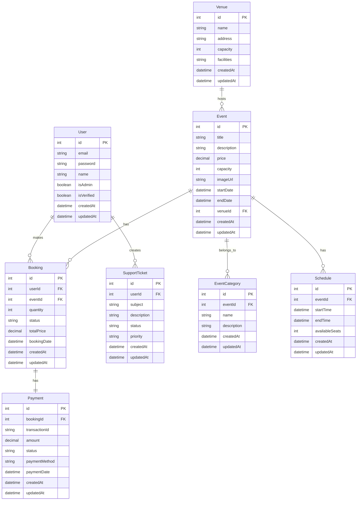

# Database Schema

## Entity Relationship Diagram



## Table Descriptions

### User Table
Stores user information and authentication details.
- Primary key: id
- Unique constraints: email
- Indexes: email, isAdmin

### Event Table
Contains event details and metadata.
- Primary key: id
- Foreign keys: venueId
- Indexes: startDate, endDate, price

### Booking Table
Records event bookings and their status.
- Primary key: id
- Foreign keys: userId, eventId
- Indexes: userId, eventId, status

### Payment Table
Tracks payment information for bookings.
- Primary key: id
- Foreign keys: bookingId
- Indexes: transactionId, status

### Venue Table
Stores venue information and capabilities.
- Primary key: id
- Indexes: name

### SupportTicket Table
Manages customer support requests.
- Primary key: id
- Foreign keys: userId
- Indexes: status, priority

### Schedule Table
Handles event timing and availability.
- Primary key: id
- Foreign keys: eventId
- Indexes: startTime, endTime

### EventCategory Table
Manages event categorization.
- Primary key: id
- Foreign keys: eventId
- Indexes: name

## Data Migration

### Initial Setup
```bash
# Create database
npx sequelize-cli db:create

# Run migrations
npx sequelize-cli db:migrate

# Seed initial data
npx sequelize-cli db:seed:all
```

### Backup Strategy
- Daily automated backups
- Point-in-time recovery
- Geographic replication (production)

## Data Lifecycle

### Creation
- Data validation
- Constraint checking
- Audit logging
- Error handling

### Updates
- Optimistic locking
- Transaction management
- Change tracking
- Version control

### Deletion
- Soft delete policy
- Cascade rules
- Archive strategy
- Data retention

## Performance Optimization

### Indexing Strategy
- Primary keys
- Foreign keys
- Common queries
- Full-text search

### Query Optimization
- Query planning
- Join optimization
- Subquery optimization
- Aggregate optimization

### Caching Strategy
- Result caching
- Query caching
- Object caching
- Cache invalidation

## Data Security

### Access Control
- Role-based access
- Row-level security
- Column-level security
- Audit logging

### Data Protection
- Encryption at rest
- Encryption in transit
- Data masking
- Secure backups

### Compliance
- GDPR requirements
- Data retention
- Data anonymization
- Access logging
