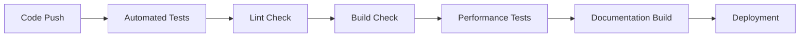

# 🧠 AI Research Project PRD Template
Version: 1.0
Last Updated: [DATE]

## 1. 📋 Executive Summary

### 1.1 Project Overview
- **Project Name**: [Project Name]
- **Research Domain**: [e.g., NLP, Computer Vision, Reinforcement Learning]
- **Principal Investigator**: [Name]
- **Timeline**: [Start Date] to [End Date]

### 1.2 Problem Statement
- Core research question/hypothesis
- Current state of the art
- Gaps in existing research
- Expected contributions

### 1.3 Success Metrics
- Research objectives (quantifiable)
- Performance benchmarks
- Publication targets
- Implementation milestones

## 2. 🔬 Research Context

### 2.1 Literature Review
- Key papers and findings
- Current methodologies
- State-of-the-art benchmarks
- Research gaps

### 2.2 Market/Field Analysis
- Similar research projects
- Commercial applications
- Competitive landscape
- Industry relevance

### 2.3 Ethical Considerations
- Bias and fairness
- Privacy implications
- Environmental impact
- Social impact
- Ethical guidelines compliance

## 3. 🎯 Research Objectives

### 3.1 Primary Objectives
- Main research questions
- Hypotheses to test
- Expected outcomes
- Success criteria

### 3.2 Secondary Objectives
- Additional research areas
- Potential applications
- Future research directions

### 3.3 Success Criteria
- Quantitative metrics
- Qualitative indicators
- Benchmark improvements
- Real-world impact

## 4. 🔧 Technical Architecture

### 4.1 Data Architecture


### 4.2 Infrastructure Requirements
- Compute resources
- Storage requirements
- Network configuration
- Security requirements

### 4.3 Development Stack
- Programming languages
- Frameworks and libraries
- Development tools
- Version control
- CI/CD pipeline

## 5. 📊 Data Strategy

### 5.1 Data Requirements
- Data sources
- Data volume
- Data quality metrics
- Update frequency

### 5.2 Data Pipeline


### 5.3 Data Governance
- Privacy requirements
- Security measures
- Compliance requirements
- Data retention policies

## 6. 🤖 Model Development

### 6.1 Model Architecture
- Model type
- Architecture design
- Components
- Integration points

### 6.2 Training Strategy
- Training approach
- Validation methods
- Testing procedures
- Performance metrics

### 6.3 Experiment Tracking
- Metrics to track
- Logging strategy
- Version control
- Result analysis

## 7. 📈 Evaluation Framework

### 7.1 Metrics
- Primary metrics
- Secondary metrics
- Baseline comparisons
- Statistical tests

### 7.2 Validation Strategy
- Cross-validation
- Test sets
- Real-world validation
- A/B testing

### 7.3 Benchmark Suite
- Standard benchmarks
- Custom benchmarks
- Comparison methodology
- Performance targets

## 8. 🚀 Implementation Plan

### 8.1 Project Phases
1. **Phase 1: Foundation** (X weeks)
   - Literature review
   - Data collection
   - Infrastructure setup

2. **Phase 2: Development** (X weeks)
   - Model development
   - Training pipeline
   - Initial results

3. **Phase 3: Optimization** (X weeks)
   - Performance tuning
   - Benchmark testing
   - Documentation

4. **Phase 4: Validation** (X weeks)
   - Comprehensive testing
   - Peer review
   - Paper writing

### 8.2 Timeline


### 8.3 Resource Allocation
- Team roles
- Computing resources
- Budget allocation
- External dependencies

## 9. 📋 Quality Assurance

### 9.1 Code Quality
- Coding standards
- Code review process
- Documentation requirements
- Testing requirements

### 9.2 Experiment Quality
- Reproducibility requirements
- Statistical validation
- Peer review process
- Documentation standards

### 9.3 Research Quality
- Publication standards
- Review process
- Documentation requirements
- Archival strategy

## 10. 📊 Monitoring & Reporting

### 10.1 Progress Tracking
- Weekly updates
- Monthly reports
- Quarterly reviews
- Annual assessments

### 10.2 Performance Monitoring
- Model performance
- System performance
- Resource utilization
- Cost tracking

### 10.3 Documentation
- Research notes
- Code documentation
- Experiment logs
- Publication drafts

## 11. 🛡️ Risk Management

### 11.1 Technical Risks
- Computational limitations
- Data quality issues
- Performance bottlenecks
- Integration challenges

### 11.2 Research Risks
- Hypothesis validation
- Reproducibility issues
- Publication challenges
- Competition risks

### 11.3 Operational Risks
- Resource constraints
- Timeline delays
- Budget overruns
- Team changes

## 12. 📚 Documentation Requirements

### 12.1 Research Documentation
- Methodology documentation
- Experiment documentation
- Results documentation
- Analysis documentation

### 12.2 Technical Documentation
- System architecture
- Code documentation
- API documentation
- Deployment guides

### 12.3 User Documentation
- Usage guidelines
- Maintenance guides
- Troubleshooting guides
- Best practices

## 13. 🤝 Collaboration Strategy

### 13.1 Internal Collaboration
- Team communication
- Code sharing
- Knowledge sharing
- Review process

### 13.2 External Collaboration
- Research partnerships
- Industry collaboration
- Open source strategy
- Publication strategy

### 13.3 Community Engagement
- Conference presentations
- Blog posts
- Social media
- Open source contributions

## 14. 🎓 Publication Strategy

### 14.1 Target Venues
- Primary conferences
- Journal submissions
- Workshop presentations
- Preprint servers

### 14.2 Publication Timeline
- Paper drafting
- Internal review
- Submission deadlines
- Revision cycles

### 14.3 Supporting Materials
- Code repositories
- Dataset publications
- Documentation
- Supplementary materials

## 15. 🔄 Git & DevOps Best Practices

### 15.1 Repository Initialization
- **Repository Setup**
  - Initialize with README.md
  - Add .gitignore for research artifacts
  - Configure branch protection rules
  - Enable required status checks

- **Issue Templates**
  ```yaml
  # Research Task Template
  name: Research Task
  description: New research task or experiment
  labels: [research]
  body:
    - type: markdown
      attributes:
        value: "## Research Task Details"
    - type: input
      attributes:
        label: Objective
        description: What is the research goal?
    - type: textarea
      attributes:
        label: Methodology
        description: Describe the research approach
    - type: textarea
      attributes:
        label: Expected Outcomes
        description: What results do you expect?
    - type: checkboxes
      attributes:
        label: Prerequisites
        options:
          - label: Literature review completed
          - label: Data requirements identified
          - label: Computing resources available
  ```

- **PR Templates**
  ```markdown
  ## Description
  [Describe changes and their impact]

  ## Type of Change
  - [ ] Research Experiment
  - [ ] Model Architecture
  - [ ] Data Pipeline
  - [ ] Documentation
  - [ ] Infrastructure

  ## Validation
  - [ ] Experiment is reproducible
  - [ ] Results are documented
  - [ ] Tests added/updated
  - [ ] Documentation updated
  ```

- **Project Labels**
  - Priority: `p0`, `p1`, `p2`
  - Type: `research`, `engineering`, `documentation`
  - Stage: `planning`, `in-progress`, `review`, `blocked`
  - Domain: `model`, `data`, `infrastructure`

- **Project Milestones**
  - Research phases
  - Publication deadlines
  - Model releases
  - Dataset versions

### 15.2 Project Structure
```
research-project/
├── .github/
│   ├── ISSUE_TEMPLATE/
│   ├── PULL_REQUEST_TEMPLATE.md
│   └── workflows/
├── data/
│   ├── raw/
│   ├── processed/
│   └── README.md
├── docs/
│   ├── experiments/
│   ├── models/
│   └── results/
├── models/
│   ├── checkpoints/
│   └── configs/
├── notebooks/
├── scripts/
├── src/
│   ├── data/
│   ├── models/
│   └── utils/
├── tests/
├── .gitignore
├── README.md
└── requirements.txt
```

### 15.3 Git Workflow
- **Branch Strategy**
  - `main`: Production-ready code
  - `develop`: Integration branch
  - `feature/*`: New features
  - `bugfix/*`: Bug fixes
  - `research/*`: Research experiments
  - `docs/*`: Documentation updates

### 15.2 Commit Standards
- **Commit Message Format**
  ```
  type(scope): description
  
  [optional body]
  [optional footer]
  ```
  Types: feat, fix, docs, style, refactor, test, chore
  Example: `feat(model): add attention mechanism to transformer`

### 15.3 Code Review Process
- Required reviewers for each PR
- Automated checks (linting, tests)
- Performance impact review
- Documentation review
- Experiment reproducibility check

### 15.4 CI/CD Pipeline


### 15.5 Release Management
- Semantic versioning (MAJOR.MINOR.PATCH)
- Release notes requirements
- Changelog maintenance
- Model versioning
- Dataset versioning
- Experiment tracking

### 15.6 Environment Management
- Development environment setup
- Testing environment configuration
- Production environment standards
- Environment parity
- Configuration management
- Secret management

## Appendix

### A. Glossary
- Technical terms
- Acronyms
- Project-specific terms
- Research terminology

### B. References
- Research papers
- Technical documentation
- Related projects
- External resources

### C. Change Log
- Version history
- Major changes
- Decision records
- Update timeline
